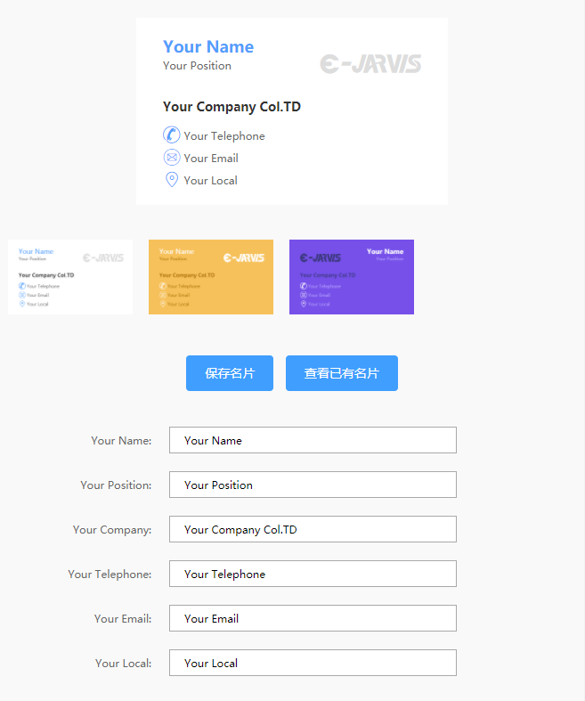
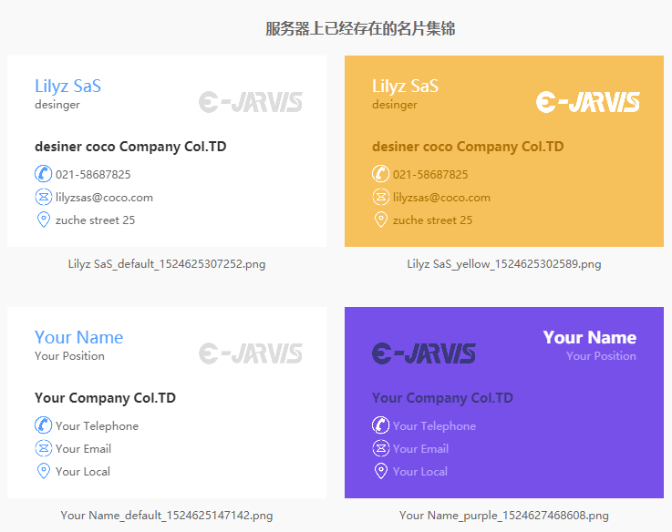

# canvas

> canvas 实现绘制名片并上传至服务器

## Build Setup

``` bash
# install dependencies
npm install

# serve with hot reload at localhost:8345
npm start

# build for production with minification
npm run build

# build for production and view the bundle analyzer report
npm run build --report
```
## CANVAS
* 填充背景
```
ctx.fillStyle = "#fff";
```
* 创建文字 
```
//text x y maxwidth
ctx.textAlign = 'top|bottom|left|right';
ctx.fillText(this.card.Name, 30, 20, 290);
```
* 创建图片
```
let img = new Image();
img.onload = function (e) {
    //img x y w h
    ctx.drawImage(img, 30, 120, 18,18);
}
img.src = "./static/images/xxx.jpg";
```
* 渐变
```
createLinearGradient(x0,y0,x1,y1);
createRadiaGradient(x0,y0,r0,x1,y1,r1);
```
* base64
```
canvas.toDataURL("image/png");
```

## 功能
* 保存名片
* 查看服务器上已经存在的名片

## 图片服务器
> 来源：[ImageServer](https://github.com/adohe/ImageServer/)

## 常见问题
* [HTML5 Canvas toDataURL returns blank
](https://stackoverflow.com/questions/31193418/html5-canvas-todataurl-returns-blank)
* canvas 转 base64 时必须等待图片加载完成之后才可以

## CAPTURE

